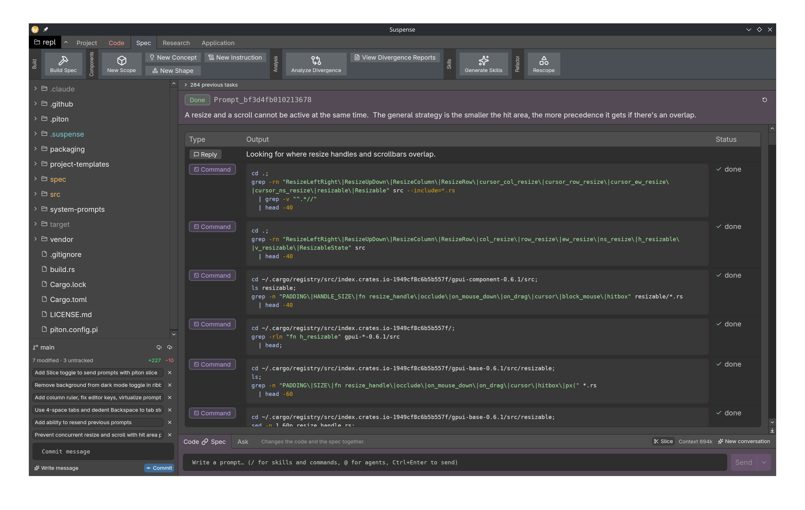

# Suspense

A REPL and notebook for Piton: write prompts that reference the spec and keep a history of prompts saved as files.



## Install

Suspense installs from source with `cargo xtask install`, which builds it in release and installs it for you, with an entry in your app menu. It installs for your user only, so it doesn't need `sudo` or an administrator.

### What you'll need

- [Rust](https://rustup.rs), stable.
- [Git](https://git-scm.com).
- On Linux, the libraries the UI builds against. On Debian or Ubuntu:

  ```sh
  sudo apt-get install pkg-config libxkbcommon-dev libxkbcommon-x11-dev libwayland-dev \
    libx11-xcb-dev libxcb1-dev libfontconfig-dev libfreetype-dev libvulkan-dev
  ```

- On macOS, the Xcode command line tools (`xcode-select --install`).
- On Windows, the [Visual Studio C++ build tools](https://visualstudio.microsoft.com/visual-cpp-build-tools/), which rustup offers to install.

When it runs, Suspense uses `piton`, `git` and `claude`. They need to be on the `PATH` your desktop gives apps, not just your shell's, because apps launched from the menu don't read your shell profile.

### Installing

```sh
git clone https://github.com/piton-lang/suspense.git
cd suspense
cargo xtask install
```

Where it goes:

| Platform | App | Menu entry |
| --- | --- | --- |
| Linux | `~/.local/bin/suspense` | `~/.local/share/applications/com.piton-lang.suspense.desktop`, with icons in `~/.local/share/icons/hicolor` |
| macOS | `~/Applications/Suspense.app` | Launchpad and Spotlight |
| Windows | `%LOCALAPPDATA%\Programs\Suspense\suspense.exe` | Start menu, `Suspense` |

On Linux, add `~/.local/bin` to your `PATH` to run `suspense` from a terminal too. The menu entry works either way.

### Updating

Pull and install again:

```sh
git pull
cargo xtask install
```

On Windows, close Suspense first, as Windows won't replace a running program.

### Uninstalling

Delete what the install put in place:

- **Linux:** `~/.local/bin/suspense`, `~/.local/share/applications/com.piton-lang.suspense.desktop`, and `com.piton-lang.suspense.*` under `~/.local/share/icons/hicolor/*/apps/`.
- **macOS:** `~/Applications/Suspense.app`.
- **Windows:** the `%LOCALAPPDATA%\Programs\Suspense` folder, and `Suspense.lnk` in `%APPDATA%\Microsoft\Windows\Start Menu\Programs`.

## License

[PolyForm Perimeter License 1.0.0](LICENSE.md)
